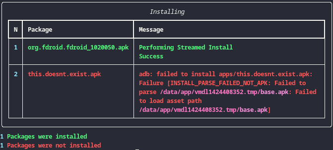

# :robot: Fdroid-auto
[https://github.com/f-droid/artwork]: #
<br>

# :bookmark: Table of contents
1. [About](#about)
2. [Installation](#installation)
3. [Usage](#usage)
4. [Output](#output)
5. [Options](#options)
6. [Notes](#notes)

## :question: About <a name="about"></a>
Fdroid-auto is a very little program that automates the process of uninstalling, downloading and installing [F-droid](https://f-droid.org) apk's through [ADB](https://developer.android.com/tools/adb).

This is useful when doing Factory resets or changing of phone and don't want to deal with the repetitive task of [bootloop](https://en.wikipedia.org/wiki/Booting#Bootloop) while uninstalling because you didn't remember it was an important package or manually downloading F-droid apks by typing them into the search bar and then manually installing it.

## :file_folder: Installation <a name="installation"></a>

### :hand: Manual
```sh
sudo apt-get install adb python3
git clone https://codeberg.org/Sivefunc/fdroid-auto
cd fdroid-auto
python3 -m pip install rich
```
##

## :computer: Usage <a name="usage"></a>
### Uninstalling
```sh
python3 fdroid_auto.py -u apps/uninstall.txt       # Uninstall packages listed.
```
### Downloading
```sh
python3 fdroid_auto.py -d apps/download.txt apps/  # Download packages listed
                                                   # and saved them on apps/
```
### Installing
```sh
python3 fdroid_auto.py -i apps/                    # Install packages listed
                                                   # on directory apps/
```
### :handshake: Joined together
```sh
python3 fdroid_auto.py -u apps/uninstall.txt \
                       -d apps/download.txt apps/ \
                       -i apps/
```

## Output <a name="output"></a>
| Uninstalling          | Downloading           | Installing
| :---:  		        | :---:    		        | :---:
| | | 

## :gear: Options <a name="options"></a>
usage: fdroid-auto [options]

- `-h,              --help                        → show this help message
                                                        and exit.`
- `-v,              --version                     → show program's version
                                                        number and exit.`
- `-u [FILE],       --uninstall [FILE]            → Uninstall ALL packages
                                                        listed from FILE on
                                                        device using adb.`
- `-d [FILE] [DIR], --download [FILE] [DIR]       → Download ALL fdroid .apks
                                                        listed from FILE and
                                                        push them into DIR.`
- `-i [DIR],        --install [DIR]               → Install ALL packages .apk
                                                        listed from DIR on
                                                        device using adb.`
- `n,               --notation                    → Shows how to format the
                                                        FILE and exit.`
## :notebook: Notes <a name="notes"></a>
- :bangbang: The order of events occur in the following way:
    - Uninstall: `adb shell pm uninstall -k --user 0`
    - Download
    - Install:   `adb install`

- There are two files [apps/uninstall.txt](src/apps/uninstall.txt) and [apps/download.txt](src/apps/download.txt) which are examples files you can use.
- Suggested versions are the ones downloaded (not the latest unstable? version).
- :shield: [Official](https://f-droid.org/docs/All_our_APIs/) repository is the one being used.
- [Third party repositories](https://forum.f-droid.org/t/known-repositories/721) are not supported like [Bromite](https://www.bromite.org/fdroid)
- Uninstall/Install of apps is not limited to only F-droid, if these are installed or on a directory respectively.
- I haven't tested ADB through [Wi-Fi](https://developer.android.com/tools/adb#connect-to-a-device-over-wi-fi) only USB.
- Manuals I used: man adb or adb shell pm
- Read the source code to know things are done, specially [packages.py](src/packages.py)

## Made by :link: [Sivefunc](https://gitlab.com/sivefunc)
## Licensed under :link: [GPLv3](LICENSE)
